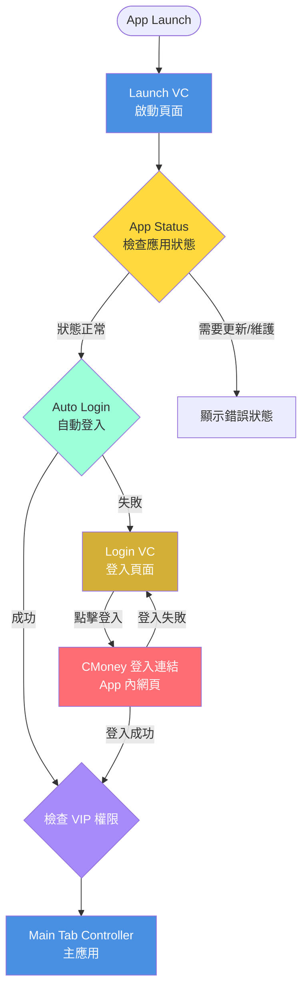

## 📋 文檔更新日期

2026年3月25日

---

## 🎯 產品簡介

**林恩如-長線聚寶盆Plus** 是一款專業的台股選股應用程式，將林恩如老師在台股經年累月的經驗與技術分析，透過程式化工具提供給學員，使學員可於軟體中獲得台股個股的進場依據與買進/賣出訊號參考。

訊號由林恩如老師所推倡的**週20MA策略**與四大法寶「均線」、「趨勢線」、「型態」、「成交量」量化為簡單明瞭的**「星等」策略**為主軸，再進一步配合型態看趨勢、挑噴出/回檔、領頭羊類股、強勢線等策略，使學員能夠用最簡單的方式參與股市行情。

### 產品目標

主要協助林恩如老師的學員於台股交易中使用，其產品的目標客戶鎖定在對於台股市場**新老手、有興趣的用戶**為主，配合老師的於課程中傳授的交易策略，進而提供學員於台股市場買賣進出的判斷。

使用設計上以**星等、線段提示**為主，因此在設計上採用一開軟體即可使用，無須設定山選條件較為直接、易上手的設計理念為主，使用戶可以最直觀的判定加權指數/個股市場動向。

### 核心特色

- ✅ **恩如三部曲評分系統**：0-2星評分（挑噴出/回檔、看型態、看量找動能）
- ✅ **多方/空方策略**：靈活切換多空市場策略
- ✅ **即時社團互動**：VIP專屬長線精英討論群
- ✅ **專業影音內容**：教學影片、講座、文章、Podcast
- ✅ **智能篩選系統**：多層級 AND 交集篩選，精準選股
- ✅ **自選股管理**：個人化自選股清單，即時追蹤

### 重要文件

- ✅ **開發用圖片**：https://www.figma.com/design/DJXNXOHqATG7fVxSZrruWF/%E6%9E%97%E6%81%A9%E5%A6%82--%E9%95%B7%E7%B7%9A%E8%81%9A%E5%AF%B6%E7%9B%86APP?node-id=841-2&p=f&t=b6ZlMAR8FhNe4bE8-0
- ✅ **github**：https://github.com/sunny2001522/Linenruwealthpool.git

中文名稱：_長線聚寶盆_
英文名稱：_LinEnRu-Longterm_
主要語言：繁體中文

※ 請說明此 App 是否為產品線公版：否

【創建app id所需的資料】
iOS BundleName: CMoney.LinEnRuLongTerm
Android ApplicationId: com.cmoney.linenrulongterm

clientId: cmlinenrulongterm
Google / Apple / FB 專案名稱: 長線聚寶盆
Firebase 專案名稱: LinEnRu-Longterm
Firebase Admin Json: 在附件

Android 簽署金鑰密碼: t;6vu04rm41l3q/6

正式 FB應用程式編號:
正式 FB應用程式用戶端權杖:
測試 FB應用程式編號:
測試 FB應用程式用戶端權杖:

Firebase AppId

Android: 1:1012349986474:android:f2a63e98984bb3a74292d3

iOS: 1:1012349986474:ios:5e3eeb45689a0f774292d3

CRM聊天室Serert
vip: bba0f225-bf7a-4fff-a876-4b27ed3ba21f
一般: dd0622d6-4cd7-46a8-955e-ccad1ea7d94e

Firebase - Remote Config
操作切換試用機制
建立金鑰
cc3f8a64-2a8c-430f-b2ac-44eddb99b9fb

權限包編號：67024

修改付費為2500/月

設定在https://docs.google.com/spreadsheets/d/1XBMY1AYcOXN9p8jjzHAtWrHHA4jB2sSmrihHo2Fx3b8/edit?usp=sharing


## 🎨 設計系統

### 配色方案

#### 主色調

- **主色調藍色**：`#4A90E2`
- **藍色漸層終點**：`#6BB6FF`
- **強調色金色**：`#D4AF37`
- **金色漸層終點**：`#F4D03F`

#### 台股專用顏色（嚴格遵守）

- **紅色（上漲）**：`#FE6D73`
- **綠色（下跌）**：`#4CCE9C`

#### 深色背景

- **起點**：`#2A1F1A`
- **中點**：`#1C1410`
- **終點**：`#000000`

#### 其他顏色

- **白色**：`#FFFFFF`
- **文字淺色**：`rgba(255,255,255,0.4)`
- **收藏粉紅色**：`#EC4899`
- **直播紅色**：`#EF4444`

### 設計原則

1. ❌ **嚴禁使用黃藍漸層**
2. ✅ **僅能使用純藍色系的微漸層**
3. ✅ **台股紅漲綠跌規則絕對不可改變**
4. ✅ **VIP版與一般版需有明確視覺區分**
5. 星星圖案在
   https://www.figma.com/design/DJXNXOHqATG7fVxSZrruWF/%E6%9E%97%E6%81%A9%E5%A6%82--%E9%95%B7%E7%B7%9A%E8%81%9A%E5%AF%B6%E7%9B%86APP?node-id=813-934&t=BCMkBzb41nv68rTX-0

紅色用FE6D73 綠色用4CCE9C
藍色用4A90E2

---

## 📱 應用程式流程圖

### 完整啟動流程



### 啟動頁面（Launch VC）

**路徑**：`/`
**組件**：`LaunchScreen`
**功能**：

1. 顯示品牌「長線聚寶盆」
2. 顯示版本號（例：Version 1.0.11）
3. 檢查應用狀態（App Status）
4. 如果狀態正常，執行自動登入（Auto Login）

**視覺設計**：

- 背景：與主頁面相同的漸層背景
- 中央元素：品牌文字 + Loading 圓圈
- 底部元素：App 版本號

---

### 登入頁面（Login VC）

**路徑**：`/login`
**組件**：`LoginPage`
**功能**：

1. **CMoney 登入按鈕**：點擊後在 app 內打開 CMoney 登入網頁
2. **登入成功處理**：網頁登入成功後，回到 app 並檢查 VIP 權限
3. **宇宙黑洞背景特效**：動態旋轉光環、星點、漂浮粒子

**視覺設計**：

- **背景特效**：
  - 中央黑洞：藍色漸層，旋轉縮放動畫
  - 旋轉光環：兩層光環，不同速度旋轉
  - 星點特效：30個閃爍星點
  - 漂浮粒子：15個藍色粒子上下漂浮
- **CMoney 登入按鈕**：藍金漸層按鈕（`#4A90E2` → `#D4AF37`）
  - 懸停放大效果
  - 滑動光澤效果

**登入流程**：

1. 用戶點擊「登入」按鈕
2. 在 app 內打開 CMoney 登入網頁（使用 WebView）
3. 用戶在 CMoney 網頁完成登入
4. 登入成功後，CMoney 網頁回傳登入資訊
5. App 接收登入資訊並檢查 VIP 權限
6. 判斷是否為初次登入：
   - **初次登入**：導向新手教學頁面 → 完成後進入首頁
   - **非初次登入**：直接跳轉至首頁
7. 跳轉至主應用（Main Tab Controller）`/home`

**VIP 權限檢查**：

- 在登入成功後立即檢查 VIP 權限
- 在每一頁也會再次檢查 VIP 權限
- 這樣確保用戶在 app 內購買 VIP 後，跳到其他頁面時會立即擁有 VIP 權限

---

## 🗂️ 應用狀態控制系統（App Status）

### 狀態碼定義

| 狀態碼 | 狀態名稱         | 用戶體驗                         | 是否可取消 |
| ------ | ---------------- | -------------------------------- | ---------- |
| **2**  | 審查模式         | 正常使用，購買導向原生 App Store | N/A        |
| **1**  | 正常使用         | 正常使用所有功能                 | N/A        |
| **0**  | 系統維護中       | 顯示維護公告，無法使用           | 否         |
| **-1** | 需要更新（強制） | 必須更新才能使用                 | 否         |
| **-2** | 建議更新         | 可選擇稍後更新                   | 是         |

### 狀態檢查流程

**檢查時機**：

1. **應用啟動時** - Launch VC 載入時
2. **從背景恢復時** - 應用從背景切回前景時
3. **定期檢查** - 應用運行時每 30 分鐘檢查一次

**檢查流程**：

```
應用啟動（Launch VC）
    ↓
獲取應用狀態 (API)
    ↓
判斷狀態碼
    ├─ 狀態碼 = 2  → 啟用審查模式 → 繼續進入應用
    ├─ 狀態碼 = 1  → 正常模式 → 繼續進入應用
    ├─ 狀態碼 = 0  → 顯示維護頁面 → 無法進入
    ├─ 狀態碼 = -1 → 顯示強制更新彈窗 → 導向 App Store
    └─ 狀態碼 = -2 → 顯示建議更新彈窗 → 可選擇稍後
```

### 審查模式（狀態碼 2）

**使用時機**：

- 提交 App Store 審查時
- Apple 審查期間

**功能特點**：

- 購買功能導向原生 IAP（In-App Purchase）
- 不顯示外部連結或網頁購買選項
- 所有其他功能正常運作

### 強制更新（狀態碼 -1）

**觸發條件**：

- 發現重大安全漏洞
- 舊版本無法正常運作
- API 版本不相容

**視覺設計**：

- ❌ 彈窗無法關閉（無「X」按鈕）
- ⚠️ 唯一操作：「立即更新」按鈕
- 🔒 阻擋應用使用，無法繞過

### 建議更新（狀態碼 -2）

**使用場景**：

- 新功能發布
- 效能優化
- 非關鍵性 bug 修復

**視覺設計**：

- ✅ 可關閉彈窗（提供「X」按鈕）
- 🔄 雙選項：「立即更新」和「稍後提醒」
- ✅ 可繼續使用應用

---

## 📊 底部導覽列（6個主要標籤）

### 1️⃣ 首頁（HomePage）

**路徑**：`/home`
**圖標**：🏠 Home
**功能**：

- 頂部工具列：搜尋按鈕（導航至 `/search`）、通知鈴鐺（導航至 `/notifications`，藍色未讀點提示）
- Banner 輪播（Carousel）
- 跑馬燈（熱門焦點股票上方，小字滾動訊息，hover 暫停）
- 加權指數即時資訊
- 大盤指數圖表（日K、週K）
- 多方/空方趨勢判斷
- 熱門焦點股票排行
- 快速導航至其他功能

**視覺元素**：

- 大盤指數卡片
- 趨勢燈號（紅/綠/黃）
- 火焰圖示（強勢股）

---

### 2️⃣ 選股（StockPickerPage）

**路徑**：`/home/stock-picker`
**圖標**：📊 BarChart3
**功能**：

- 三層級篩選系統
- 恩如三部曲評分顯示
- 多方/空方策略切換
- AND 交集篩選

**篩選層級**：

1. **第一層**：多方 / 空方
2. **第二層**：站上週20MA / 強勢週20MA / 跌破週20MA / 弱勢週20MA
3. **第三層**：領頭羊產業、211強勢、爆量、股本、周均量

**權限控制**：

- VIP版：完整顯示所有股票
- 一般版：僅顯示前3支股票，其餘模糊 + 金色鎖頭

---

### 3️⃣ 自選（WatchlistPage）

**路徑**：`/home/watchlist`
**圖標**：⭐ Eye
**功能**：

- 個人化自選股清單
- 即時價格更新
- 快速查看恩如三部曲評分
- 拖曳排序
- 管理群組彈窗（`+` 按鈕開啟）：列出所有群組含檔數，可刪除群組（減號按鈕），剩最後一個群組時刪除按鈕自動隱藏，底部可新增群組

**權限控制**：

- VIP版：無上限儲存股票，支援多組清單
- 一般版：最多儲存 10 支股票，僅 1 組清單

---

### 4️⃣ 社團（DiscussionPage）

**路徑**：`/home/discussion`
**圖標**：💬 MessageCircle
**功能**：

- 長線精英討論群（VIP專屬）
- 一般討論區（所有用戶）
- 發文、回文
- 表情反應
- 貼文編輯歷史
- 檢舉機制

**權限控制**：

- **VIP版**：可以看到「長線精英討論群」的內容
- **一般版**：無法看到「長線精英討論群」的內容
- 其他功能（發文、回文、表情反應）兩者無差異

---

### 5️⃣ 內容（ContentPage）

**路徑**：`/home/content`
**圖標**：📄 FileText
**功能**：

- 四大分頁：影音、講座、文章、Podcast
- YouTube 風格設計
- 篩選器：分類、排序、時間範圍、VIP 篩選
- 收藏功能

**權限控制**：

- **VIP版**：可以看所有內容（無離線下載功能）
- **一般版**：可以看部分內容
  - 免費內容：完整觀看
  - VIP 內容：鎖定或僅顯示部分

---

### 6️⃣ 會員（MorePage）

**路徑**：`/home/more`
**圖標**：👤 User
**功能**：

- 個人資料顯示
- 會員等級（VIP版/一般版）
- 設定：編輯個人資料、通知設定
- 購買 VIP
- 客服中心
- 幫助中心
- 登出

---

## 🔐 VIP 權限控制系統

### 權限分類

| 功能區域           | VIP版（isVIP: true）                       | 一般版（isVIP: false）                                      |
| ------------------ | ------------------------------------------ | ----------------------------------------------------------- |
| **選股頁面**       | ✅ 完整顯示所有股票                        | ⚠️ 僅顯示前 3 支，其餘模糊 + 金色鎖頭                       |
| **恩如三部曲評分** | ✅ 完整評分資訊 (0-2 星)                   | ⚠️ 僅顯示部分評分資訊                                       |
| **影音內容**       | ✅ 無限制觀看所有影音<br>✅ 無廣告播放     | ⚠️ 僅可預覽前 30 秒<br>⚠️ 每日觀看限制 3 則                 |
| **社團功能**       | ✅ 可看「長線精英討論群」<br>✅ 無限制發文 | ⚠️ 無法看「長線精英討論群」<br>⚠️ 發文頻率限制（每日 3 則） |
| **自選股**         | ✅ 無上限儲存，多組清單                    | ⚠️ 最多 10 支，1 組清單                                     |

### 鎖定視覺設計規範

**模糊遮罩樣式**：

- 高斯模糊效果：blur 8px
- 金色鎖頭圖標：`#D4AF37`，尺寸 32px
- 升級提示文字：「升級 VIP 版解鎖」
- 半透明黑色背景：`rgba(0, 0, 0, 0.8)`
- 圓角按鈕：20px

**升級提示頻率**：

- 首次進入每個功能頁面：顯示功能說明浮層
- 點擊鎖定功能時：顯示登入/升級彈窗
- 使用達一定時間後：主動推薦升級

---

## 📈 產品交易策略

### 選擇主策略

**step1.** 系統預設值為「多方策略」、「站上週20MA」(波段股)作為主要策略之一

**step2.** 選擇其他篩選條件作為主要監控策略：

#### 多方策略

1. **站上週20MA(波段股)**
   - 備註：低成本且好防守，但需要較長的時間等待

2. **強勢週20MA之上(主升段強勢股)210策略**
   - 備註：等待時間較少，需要可接受一定風險，波動大，需承受較大的停損

3. **強勢週20MA之上(高角度強勢股)211策略**
   - 備註：等待時間較少，需要可接受一定風險，波動大，需承受較大的停損

#### 空方策略

- 跌破週20MA
- 弱勢週20MA之下

### 看星星挑好股（恩如三部曲）

利用恩如三部曲挑選好標的：

#### 1. 挑噴出/回檔

- **一星**：剛噴出
- **二星**：突破後回檔有支撐

#### 2. 選型態看趨勢

- 星星越多，越容易同時符合破切W底

#### 3. 看量找動能

- 星星越多，大戶越看重

### 查看強勢股(火焰)、領頭羊類股、強勢線

- **強勢股（火焰）**：收盤價 > 領頭羊價，代表是超級強勢股
- **領頭羊類股**：目前盤勢最強類股、比較當期與前期的強勢族群（每月第一個交易日更新）
- **強勢線**：日K線在強勢線上，是超級強勢股

### 週20MA乖離進場前先想風險

目前股價與週20MA距離，以%數顯示，並以該數值作為最大風險參考

---

## 🛣️ 路由結構

### 獨立頁面（無底部導覽列）

| 路徑                  | 組件                  | 說明                                     | 需要登入 |
| --------------------- | --------------------- | ---------------------------------------- | -------- |
| `/`                   | LaunchScreen          | 啟動頁面（App Status 檢查 + Auto Login） | ❌       |
| `/login`              | LoginPage             | 登入頁面（CMoney 登入連結）              | ❌       |
| `/guide`              | GuidePage             | 新手教學                                 | ✅       |
| `/edit-profile`       | EditProfilePage       | 編輯個人資料                             | ✅       |
| `/help-center`        | HelpCenterPage        | 幫助中心                                 | ❌       |
| `/purchase`           | PurchasePage          | 購買頁面（原生 App Store）               | ✅       |
| `/web-purchase`       | WebPurchasePage       | 網頁購買頁面                             | ✅       |
| `/stock/:code`        | StockDetailPage       | 股票詳情頁                               | ❌       |
| `/industry-selection` | IndustrySelectionPage | 產業選擇頁面                             | ❌       |
| `/notifications`      | NotificationCenterPage | 通知中心（鈴鐺入口）                    | ❌       |
| `/search`             | SearchPage            | 搜尋股票頁面                             | ❌       |

### 主框架頁面（有底部導覽列）

| 路徑                 | 組件            | 底部導覽標籤 |
| -------------------- | --------------- | ------------ |
| `/home`              | HomePage        | 首頁 🏠      |
| `/home/stock-picker` | StockPickerPage | 選股 📊      |
| `/home/watchlist`    | WatchlistPage   | 自選 ⭐      |
| `/home/discussion`   | DiscussionPage  | 社團 💬      |
| `/home/content`      | ContentPage     | 內容 📄      |
| `/home/more`         | MorePage        | 會員 👤      |

---

## 🔧 工程師配置說明

### 配置文件位置

**文件位置**：`/lib/appConfig.ts`

### 需要配置的項目

1. **審查模式開關**：`IS_REVIEW_MODE`（true=審查模式, false=正式模式）
2. **網頁購買連結**：`WEB_PURCHASE_URL`
3. **線上客服連結**：`CUSTOMER_SERVICE_URL`
4. **CMoney 登入連結**：`CMONEY_LOGIN_URL`
5. **App Store 連結**：`APP_STORE_URL`（iOS 和 Android）
6. **當前版本**：`CURRENT_VERSION`

### 原生功能橋接

**橋接文件**：`/lib/nativeBridge.ts`

需要實現的原生功能：

1. **App 評分功能**
2. **分享給好友功能**
3. **打開 CMoney 登入網頁**
4. **接收 CMoney 登入回傳**
5. **打開 App Store**

---

## 🔧 技術架構

### 前端框架

- **React 18**：UI 框架
- **React Router**：路由管理（使用 `react-router` 包）
- **TypeScript**：類型安全
- **Tailwind CSS v4**：樣式系統

### UI 組件庫

- **shadcn/ui**：基礎 UI 組件
- **Lucide React**：圖標庫
- **Recharts**：圖表庫
- **Motion**：動畫庫（從 `motion/react` 導入）

### 狀態管理

- **Context API**：
  - `authContext`：用戶認證狀態
  - `tabContext`：標籤狀態管理
- **Local Storage**：本地數據持久化

### 原生橋接

- **nativeBridge.ts**：原生功能橋接
  - `openAppStore()`：打開 App Store
  - `checkAppStatus()`：檢查應用狀態
  - `openCMoneyLogin()`：打開 CMoney 登入網頁
  - `handleCMoneyLoginCallback()`：處理 CMoney 登入回傳
  - `openAppRating()`：打開 App 評分
  - `shareToFriend()`：分享給好友

---

## 📦 文檔結構

本專案共有 7 個主要文檔：

1. **00_APP_OVERVIEW.md**（本文檔）：整體概覽、UI Flow、App Status、產品策略
2. **01_HOME_PAGE.md**：首頁標籤詳細文檔
3. **02_STOCK_PICKER_PAGE.md**：選股標籤詳細文檔
4. **03_WATCHLIST_PAGE.md**：自選標籤詳細文檔
5. **04_DISCUSSION_PAGE.md**：社團標籤詳細文檔
6. **05_CONTENT_PAGE.md**：內容標籤詳細文檔
7. **06_MORE_PAGE.md**：會員標籤詳細文檔

---

## 🚀 開發指南

### 顏色使用原則

1. ✅ 使用 Tailwind CSS 類別
2. ✅ 需要自訂顏色時使用 `from-[#4A90E2]` 語法
3. ❌ 絕對不使用黃藍漸層
4. ✅ 台股紅漲綠跌不可改變

### 組件開發原則

1. ✅ 使用 TypeScript
2. ✅ 使用函數組件 + Hooks
3. ✅ 使用 `fast_apply_tool` 進行編輯
4. ✅ 遵循 React Router Data Mode 模式

### 路由配置原則

1. ✅ 使用 `react-router` 包（不是 `react-router-dom`）
2. ✅ 主框架使用 `Layout` 組件
3. ✅ 詳情頁面不使用 Layout
4. ✅ 使用 `createBrowserRouter` 配置路由

---

## 📞 聯絡資訊

**產品名稱**：林恩如-長線聚寶盆Plus

**目標用戶**：台股新老手、有興趣的用戶

**核心策略**：週20MA策略 + 恩如三部曲（挑噴出/回檔、看型態、看量找動能）

---

## 📝 更新歷史

| 日期       | 版本 | 更新內容                                                                                                                                             |
| ---------- | ---- | ---------------------------------------------------------------------------------------------------------------------------------------------------- |
| 2026-03-25 | 5.0  | **個股頁面 (StockDetailPage)**：Tab「日K」改為「K棒」並採用底線樣式；新增日/周/月/年時間週期選擇器（預設：周）；開高低收、MA/領頭羊數據改為 4 欄排版；K線圖使用靜態數據，Y軸移至左側；成交量圖改為灰色；技術線選擇器固定底部 44px，使用白色打勾圖示。**大盤頁面 (MarketIndexPage)**：重構為與個股頁面相同元件樣式；僅保留日/周/月選擇器（無 K棒/即時/基本資訊 tabs）；成交量圖改為灰色 |
| 2026-03-19 | 4.0  | 移除未使用的 React Native 依賴；新增 .gitignore；首頁新增搜尋按鈕與通知鈴鐺（藍色未讀點）；新增通知中心頁面（/notifications）；熱門焦點股票上方新增跑馬燈；自選股群組管理彈窗（+按鈕開啟，可刪除群組，剩最後一個時隱藏刪除按鈕）；新增 deleteWatchlistGroup 儲存函式 |
| 2026-03-09 | 3.0  | 整合 PRD 核心內容到 Overview，移除程式碼部分，保留產品策略和規格說明                                                                                 |
| 2026-03-09 | 2.0  | 重大更新：移除 Magic Link，改為 CMoney 登入連結；權限名稱改為 VIP版/一般版；更新社團和內容權限說明；整合 APP_STATUS_CONTROL 和 DEVELOPER_CONFIG 文檔 |
| 2026-03-09 | 1.0  | 初版：整合所有文檔內容，創建完整概覽                                                                                                                 |

---

## 📋 核心概念總結

### 恩如三部曲評分系統

- **評分範圍**：0-2顆星（最多2顆星）
- **三大評分項目**：
  1. **挑噴出/回檔** - 一星為剛噴出，二星為突破後回檔有支撐
  2. **看型態** - 星星越多，越容易同時符合破切W底
  3. **看量找動能** - 星星越多，大戶越看重
- **星星顯示**：金色漸層（`#D4AF37`）

### 主要策略分類

**多方策略**：

- 站上週20MA（波段股）
- 強勢週20MA之上（210策略）
- 強勢週20MA之上（211策略）

**空方策略**：

- 跌破週20MA
- 弱勢週20MA之下

### 技術指標

- **週20MA**：核心均線策略
- **日20MA、100MA**：輔助均線
- **強勢線**：超級強勢股判斷
- **火焰標記**：強勢股（收盤價 > 領頭羊價）
- **領頭羊類股**：每月第一個交易日更新
- **週20MA乖離**：風險參考指標

### 強勢股（火焰）顯示規則

**站上週20MA情況下**：

- 一律不顯示火焰

**強勢週20MA**：

- 多方：若收盤價 > 領頭羊 → 顯示火焰
- 空方：若收盤價 < 領頭羊 → 顯示火焰

---

**注意事項**：

- 本文檔整合了 PRD 核心產品策略和規格說明
- UI Flow 已根據提供的圖片更新
- 權限系統已從「專業版/試用版」改為「VIP版/一般版」
- 登入流程已改為 CMoney 登入連結方式
- 社團權限：VIP 可看「長線精英討論群」，其他功能無差異
- 內容權限：VIP 看所有內容（無離線下載），一般版看部分內容