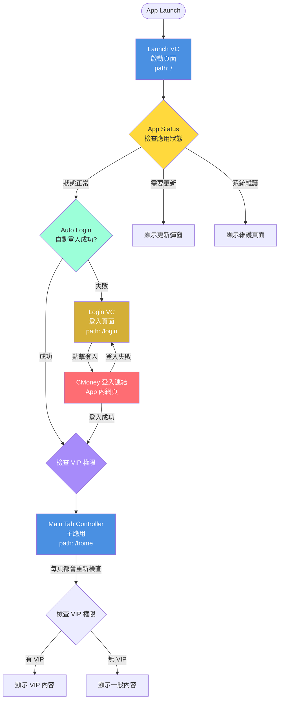

# 🔐 註冊登入歡迎導覽流程完整文檔

## 📋 文檔更新日期
2026年3月9日

---

## 🎯 流程概述

本文檔詳細說明用戶從啟動應用程式到進入主應用的完整流程，包括啟動頁、應用狀態檢查、自動登入、CMoney 登入等環節。

---

## 🚀 完整流程圖（根據圖片）



---

## 📱 1. 啟動頁面（Launch VC）

### 路由資訊
- **路徑**：`/`
- **組件**：`LaunchScreen`
- **主要功能**：App Status 檢查 + Auto Login

### 視覺設計

```tsx
export function LaunchScreen() {
  const navigate = useNavigate();
  const [status, setStatus] = useState<'loading' | 'checking' | 'success' | 'error'>('loading');

  useEffect(() => {
    checkAppStatusAndLogin();
  }, []);

  const checkAppStatusAndLogin = async () => {
    try {
      // 1. 檢查應用狀態
      setStatus('checking');
      const appStatus = await checkAppStatus();

      if (appStatus.statusCode !== 1) {
        // 狀態碼不是 1，顯示對應的錯誤或更新頁面
        handleAppStatus(appStatus);
        return;
      }

      // 2. 狀態正常，執行自動登入
      const autoLoginResult = await autoLogin();

      if (autoLoginResult.success) {
        // 自動登入成功，檢查 VIP 權限
        const vipStatus = await checkVIPStatus();
        updateVIPStatus(vipStatus);

        // 跳轉至主應用
        navigate('/home');
      } else {
        // 自動登入失敗，跳轉至登入頁
        navigate('/login');
      }
    } catch (error) {
      console.error('Launch error:', error);
      // 發生錯誤，跳轉至登入頁
      navigate('/login');
    }
  };

  return (
    <div className="h-screen flex flex-col items-center justify-center bg-gradient-to-b from-background via-background to-muted/20">
      {/* 品牌文字 */}
      <div className="text-center mb-8">
        <h1 className="text-4xl font-bold mb-2">長線聚寶盆</h1>
        <p className="text-muted-foreground">專業選股 · 智慧投資</p>
      </div>

      {/* Loading 圓形進度指示器 */}
      <div className="relative w-16 h-16">
        <div className="absolute inset-0 border-4 border-muted rounded-full"></div>
        <div className="absolute inset-0 border-4 border-[#4A90E2] rounded-full border-t-transparent animate-spin"></div>
      </div>

      {/* 狀態文字 */}
      <p className="mt-4 text-sm text-muted-foreground">
        {status === 'loading' && '載入中...'}
        {status === 'checking' && '檢查應用狀態...'}
        {status === 'success' && '登入成功！'}
        {status === 'error' && '發生錯誤'}
      </p>

      {/* 版本號 */}
      <div className="absolute bottom-8 text-center">
        <p className="text-sm text-muted-foreground">Version 1.0.11</p>
      </div>
    </div>
  );
}
```

---

## 🔐 2. 登入頁面（Login VC）

### 路由資訊
- **路徑**：`/login`
- **組件**：`LoginPage`
- **主要功能**：CMoney 登入連結

### 視覺設計特點
- **背景特效**：宇宙黑洞或超新星爆炸特效
- **CMoney 登入按鈕**：藍金漸層按鈕

### CMoney 登入流程

```tsx
export function LoginPage() {
  const navigate = useNavigate();
  const [loading, setLoading] = useState(false);

  const handleCMoneyLogin = async () => {
    try {
      setLoading(true);

      // 1. 打開 CMoney 登入網頁（在 app 內使用 WebView）
      const loginResult = await openCMoneyLoginPage();

      if (loginResult.success) {
        // 2. 登入成功，接收 CMoney 回傳的用戶資料
        const userData = loginResult.data;

        // 3. 保存用戶資料
        await saveUserData(userData);

        // 4. 檢查 VIP 權限
        const vipStatus = await checkVIPStatus(userData);
        updateVIPStatus(vipStatus);

        // 5. 跳轉至主應用
        navigate('/home');

        toast.success('登入成功！');
      } else {
        toast.error('登入失敗，請稍後再試');
      }
    } catch (error) {
      console.error('Login error:', error);
      toast.error('登入失敗，請稍後再試');
    } finally {
      setLoading(false);
    }
  };

  return (
    <div className="h-screen relative overflow-hidden">
      {/* 宇宙黑洞背景 */}
      <canvas id="cosmic-bg" className="absolute inset-0" />

      {/* 登入內容 */}
      <div className="relative z-10 h-full flex flex-col items-center justify-center p-8">
        {/* 品牌 Logo */}
        <div className="text-center mb-12">
          <h1 className="text-5xl font-bold text-white mb-3">長線聚寶盆</h1>
          <p className="text-lg text-white/80">專業選股 · 智慧投資</p>
        </div>

        {/* CMoney 登入按鈕 */}
        <button
          onClick={handleCMoneyLogin}
          disabled={loading}
          className="w-full max-w-md py-4 rounded-xl font-semibold text-lg text-white shadow-2xl hover:shadow-3xl transform hover:scale-105 transition-all duration-300 disabled:opacity-50 disabled:cursor-not-allowed"
          style={{
            background: 'linear-gradient(90deg, #4A90E2 0%, #D4AF37 100%)'
          }}
        >
          {loading ? '登入中...' : '🔐 使用 CMoney 帳號登入'}
        </button>

        {/* 提示文字 */}
        <p className="mt-6 text-sm text-white/60 text-center max-w-md">
          點擊登入後，將在 app 內開啟 CMoney 登入頁面
        </p>
      </div>
    </div>
  );
}
```

### CMoney 登入原生橋接

```typescript
// /lib/nativeBridge.ts

/**
 * 打開 CMoney 登入網頁（在 app 內使用 WebView）
 */
export async function openCMoneyLoginPage(): Promise<LoginResult> {
  if (window.NativeBridge && window.NativeBridge.openCMoneyLogin) {
    // 原生端實現
    return window.NativeBridge.openCMoneyLogin();
  } else {
    // Web fallback - 在瀏覽器中打開
    window.location.href = CMONEY_LOGIN_URL;
    return { success: false, message: 'Web fallback' };
  }
}

/**
 * 處理 CMoney 登入回傳
 */
export function setupCMoneyLoginCallback(callback: (userData: UserData) => void) {
  if (window.NativeBridge) {
    window.NativeBridge.onCMoneyLoginSuccess = callback;
  }
}
```

**原生端需實現（iOS - Swift）**：

```swift
// 打開 CMoney 登入頁面
func openCMoneyLogin() {
    let loginURL = "https://www.cmoney.tw/app/login?returnUrl=app://login-callback"
    
    // 使用 WKWebView 在 app 內打開
    let webView = WKWebView(frame: view.bounds)
    webView.load(URLRequest(url: URL(string: loginURL)!))
    present(webView, animated: true)
    
    // 監聽登入成功回調
    webView.navigationDelegate = self
}

// 接收 CMoney 登入回調
func webView(_ webView: WKWebView, decidePolicyFor navigationAction: WKNavigationAction, decisionHandler: @escaping (WKNavigationActionPolicy) -> Void) {
    if let url = navigationAction.request.url, url.scheme == "app" && url.host == "login-callback" {
        // 解析用戶資料
        let userData = parseUserDataFromURL(url)
        
        // 回傳給 JS
        let script = """
        if (window.NativeBridge && window.NativeBridge.onCMoneyLoginSuccess) {
            window.NativeBridge.onCMoneyLoginSuccess(\(userData));
        }
        """
        webView.evaluateJavaScript(script)
        
        // 關閉 WebView
        webView.dismiss(animated: true)
        
        decisionHandler(.cancel)
        return
    }
    
    decisionHandler(.allow)
}
```

**原生端需實現（Android - Kotlin）**：

```kotlin
// 打開 CMoney 登入頁面
@JavascriptInterface
fun openCMoneyLogin() {
    val loginURL = "https://www.cmoney.tw/app/login?returnUrl=app://login-callback"
    
    // 使用 WebView 在 app 內打開
    val webView = WebView(context)
    webView.settings.javaScriptEnabled = true
    webView.webViewClient = object : WebViewClient() {
        override fun shouldOverrideUrlLoading(view: WebView, request: WebResourceRequest): Boolean {
            val url = request.url.toString()
            
            if (url.startsWith("app://login-callback")) {
                // 解析用戶資料
                val userData = parseUserDataFromURL(url)
                
                // 回傳給 JS
                val script = """
                if (window.NativeBridge && window.NativeBridge.onCMoneyLoginSuccess) {
                    window.NativeBridge.onCMoneyLoginSuccess($userData);
                }
                """
                webView.evaluateJavascript(script, null)
                
                // 關閉 WebView
                (view.parent as? ViewGroup)?.removeView(view)
                
                return true
            }
            
            return false
        }
    }
    
    webView.loadUrl(loginURL)
}
```

---

## 🔐 3. VIP 權限檢查邏輯

### 檢查時機

1. **登入成功後立即檢查**：在 CMoney 登入成功後
2. **每一頁都重新檢查**：在每個頁面載入時
3. **購買 VIP 後檢查**：在 app 內購買 VIP 後

### VIP 權限判斷

```typescript
interface VIPStatus {
  isVIP: boolean;           // 是否為 VIP
  expiryDate?: string;      // 到期日（ISO8601格式）
  productId?: string;       // 產品ID
}

async function checkVIPStatus(userData?: UserData): Promise<VIPStatus> {
  // 如果沒有傳入 userData，從 Context 獲取
  if (!userData) {
    const user = getCurrentUser();
    if (!user) {
      return { isVIP: false };
    }
    userData = user;
  }

  // 1. 檢查是否有 VIP 權限
  if (!userData.vipStatus || !userData.vipStatus.hasPremium) {
    return {
      isVIP: false
    };
  }

  // 2. 檢查是否過期
  if (userData.vipStatus.expiryDate) {
    const now = new Date();
    const expiry = new Date(userData.vipStatus.expiryDate);
    
    // 已過期
    if (expiry < now) {
      // 撤銷 VIP 權限
      await revokeVIPStatus(userData.id);
      
      return {
        isVIP: false
      };
    }
    
    // 即將過期（7天內）
    const daysUntilExpiry = Math.floor(
      (expiry.getTime() - now.getTime()) / (1000 * 60 * 60 * 24)
    );
    
    if (daysUntilExpiry <= 7) {
      showExpiryWarning(daysUntilExpiry);
    }
  }

  // 3. 有效的 VIP
  return {
    isVIP: true,
    expiryDate: userData.vipStatus.expiryDate,
    productId: userData.vipStatus.productId
  };
}
```

### 每頁都重新檢查 VIP

```typescript
// 在每個頁面組件中使用
export function SomePage() {
  const { user, updateVIPStatus } = useAuth();
  const [isVIP, setIsVIP] = useState(false);

  useEffect(() => {
    // 每次進入頁面時檢查 VIP 權限
    checkAndUpdateVIPStatus();
  }, []);

  const checkAndUpdateVIPStatus = async () => {
    const vipStatus = await checkVIPStatus();
    setIsVIP(vipStatus.isVIP);
    updateVIPStatus(vipStatus);
  };

  return (
    <div>
      {isVIP ? (
        <VIPContent />
      ) : (
        <NormalContent />
      )}
    </div>
  );
}
```

---

## 🎭 4. 權限差異說明

### VIP版 vs 一般版

| 功能區域 | VIP版 | 一般版 |
|---------|-------|--------|
| **選股頁面** | ✅ 完整顯示所有股票 | ⚠️ 僅顯示前 3 支，其餘模糊 + 金色鎖頭 |
| **社團功能** | ✅ 可看「長線精英討論群」 | ⚠️ 無法看「長線精英討論群」 |
| **發文/回文** | ✅ 完整功能 | ✅ 完整功能（無差異） |
| **表情反應** | ✅ 完整功能 | ✅ 完整功能（無差異） |
| **影音內容** | ✅ 可以看所有內容 | ⚠️ 可以看部分內容 |
| **離線下載** | ❌ 無此功能 | ❌ 無此功能 |
| **自選股** | ✅ 無上限儲存，多組清單 | ⚠️ 最多 10 支，1 組清單 |

---

## 🔄 5. 自動登入邏輯

### Auto Login 流程

```typescript
async function autoLogin(): Promise<{ success: boolean; data?: UserData }> {
  try {
    // 1. 檢查本地是否有 Token
    const token = localStorage.getItem('authToken');
    if (!token) {
      return { success: false };
    }

    // 2. 驗證 Token 有效性
    const response = await fetch('/api/auth/verify', {
      headers: {
        'Authorization': `Bearer ${token}`
      }
    });

    if (!response.ok) {
      // Token 無效，清除本地資料
      localStorage.removeItem('authToken');
      localStorage.removeItem('user');
      return { success: false };
    }

    // 3. 取得用戶資料
    const userData = await response.json();

    // 4. 更新 Context
    updateUser(userData);

    return { success: true, data: userData };
  } catch (error) {
    console.error('Auto login failed:', error);
    return { success: false };
  }
}
```

---

## 📝 注意事項

### 登入流程重點
1. ✅ 使用 CMoney 登入連結，在 app 內用 WebView 打開
2. ✅ 登入成功後，CMoney 網頁回傳用戶資料
3. ✅ App 接收資料後立即檢查 VIP 權限
4. ✅ 每一頁都會重新檢查 VIP 權限

### VIP 權限重點
1. ✅ 社團：VIP 可看「長線精英討論群」，其他功能無差異
2. ✅ 內容：VIP 可看所有內容，一般版看部分內容
3. ❌ 所有版本都沒有離線下載功能
4. ✅ 在 app 內購買 VIP 後，跳到其他頁面會立即擁有 VIP 權限

### 數據存儲
- Token 存儲在 Local Storage
- 用戶資料存儲在 Context
- VIP 狀態存儲在 Context + Local Storage

---

## 📚 相關文檔

- **整體概覽**：`00_APP_OVERVIEW.md`
- **首頁標籤**：`01_HOME_PAGE.md`
- **社團標籤**：`04_DISCUSSION_PAGE.md`
- **內容標籤**：`05_CONTENT_PAGE.md`
- **會員標籤**：`06_MORE_PAGE.md`

---

## 🎯 測試檢查清單

- [ ] 啟動頁 App Status 檢查正常
- [ ] 自動登入功能正常
- [ ] CMoney 登入網頁在 app 內正確打開
- [ ] CMoney 登入成功後正確回傳用戶資料
- [ ] VIP 權限判斷正確
- [ ] 每一頁都會重新檢查 VIP 權限
- [ ] 在 app 內購買 VIP 後權限立即生效
- [ ] VIP 過期後權限正確撤銷
- [ ] 登出後返回登入頁面
