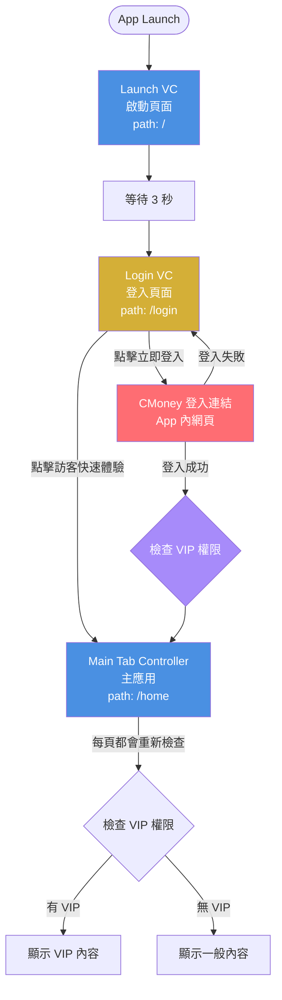

# 🔐 註冊登入歡迎導覽流程完整文檔

## 📋 文檔更新日期
2026年3月9日

---

## 🎯 流程概述

本文檔詳細說明用戶從啟動應用程式到進入主應用的完整流程，包括啟動頁、應用狀態檢查、自動登入、CMoney 登入等環節。

---

## 🚀 完整流程圖



---

## 📱 1. 啟動頁面（Launch VC）

### 路由資訊
- **路徑**：`/`
- **組件**：`LaunchScreen`
- **主要功能**：顯示品牌 Logo + 等待 3 秒 + 自動跳轉至登入頁

### 實際實現功能

#### 視覺元素
1. **品牌文字**：「長線聚寶盆」
2. **副標題**：「專業選股 · 智慧投資」
3. **Loading 圓形進度指示器**：藍色旋轉圓圈
4. **版本號**：「Version 1.0.11」（顯示於底部）

#### 流程行為
1. 用戶打開 App
2. 顯示啟動頁面（品牌 Logo + Loading 動畫）
3. **等待 3 秒**
4. 自動跳轉至登入頁面（`/login`）

#### 設計規範
- **背景漸層**：從 `background` 到 `muted/20`
- **文字顏色**：白色主標題 + 灰色副標題
- **Loading 顏色**：藍色（`#4A90E2`）
- **底部版本號**：灰色小字

---

## 🔐 2. 登入頁面（Login VC）

### 路由資訊
- **路徑**：`/login`
- **組件**：`LoginPage`
- **主要功能**：CMoney 登入 + 訪客快速體驗

### 實際實現功能

#### 視覺元素
1. **背景**：純黑色（`bg-black`）
2. **林恩如頭像**：置中顯示，高度 128px
3. **品牌名稱**：「長線聚寶盆」白色大標題
4. **副標題**：「專業選股 · 智慧投資」灰色文字
5. **立即登入按鈕**：藍色漸層（`from-[#4A90E2] to-[#6BB6FF]`）
6. **訪客快速體驗按鈕**：透明背景 + 白色邊框
7. **提示文字**：「登入後可使用完整功能」
8. **版本號**：「Version 1.0.11」（顯示於底部）

#### 按鈕功能

##### 立即登入按鈕
- **點擊行為**：調用 `openCMoneyLogin()` 原生橋接函數
- **功能**：在 App 內用 WebView 打開 CMoney 登入網頁
- **登入成功後**：
  1. CMoney 網頁回傳用戶資料（Token、userInfo、isVIP）
  2. App 監聽 `cmoney-login-success` 事件
  3. 儲存用戶資料到 authContext
  4. 自動跳轉至主應用（`/home`）

##### 訪客快速體驗按鈕
- **點擊行為**：直接導航至 `/home`
- **功能**：不需登入，以訪客身份進入
- **權限**：訪客身份為「一般版」，功能受限

#### App Status 彈窗

##### 系統維護中（狀態碼 0）
- **顯示時機**：當 App Status API 返回狀態碼 0
- **視覺**：
  - 黃色警告圖標
  - 標題：「系統維護中」
  - 說明文字：來自 API 的維護訊息
  - 預計恢復時間（如有提供）
  - 重新整理按鈕
- **行為**：無法登入，只能重新整理或退出

##### 強制更新（狀態碼 -1）
- **顯示時機**：當 App Status API 返回狀態碼 -1
- **視覺**：
  - 紅色警告圖標
  - 標題：「需要更新」
  - 說明文字：來自 API 的更新訊息
  - 最新版本號顯示
  - 立即更新按鈕（金色）
- **行為**：
  - 無法關閉彈窗
  - 唯一操作：點擊「立即更新」跳轉至 App Store
  - 阻擋所有應用功能

##### 建議更新（狀態碼 -2）
- **顯示時機**：當 App Status API 返回狀態碼 -2 且未被用戶標記為稍後提醒
- **視覺**：
  - 藍色通知圖標
  - 標題：「發現新版本」
  - 說明文字：來自 API 的更新訊息
  - 更新亮點列表（如有提供）
  - 最新版本號顯示
  - 兩個按鈕：「稍後提醒」（灰色） + 「立即更新」（藍色漸層）
  - 右上角關閉按鈕（X）
- **行為**：
  - 可關閉彈窗
  - 點擊「稍後提醒」會記錄時間戳，24 小時內不再顯示
  - 點擊「立即更新」跳轉至 App Store
  - 可繼續使用應用

---

## ⚙️ 3. 工程師需要實現的原生橋接功能

以下功能在 `/lib/nativeBridge.ts` 中定義介面，需要原生端（iOS / Android）實現：

### 3.1 CMoney 登入橋接

#### 函數：`openCMoneyLogin()`
**功能**：在 App 內用 WebView 打開 CMoney 登入網頁

**實現方式**：
- **iOS (Swift)**：使用 `WKWebView` 在 App 內打開登入頁面
- **Android (Kotlin)**：使用 `WebView` 在 App 內打開登入頁面
- **登入 URL**：由配置文件 `CMONEY_LOGIN_URL` 提供

**回調處理**：
- CMoney 登入成功後，網頁會跳轉至特殊 URL（例：`app://login-callback?token=xxx&...`）
- 原生端攔截此 URL，解析參數
- 觸發 JavaScript 事件 `cmoney-login-success`，並傳遞用戶資料：
  ```javascript
  {
    token: "xxx",
    userInfo: {
      name: "用戶名稱",
      email: "user@example.com",
      avatar: "頭像URL"
    },
    isVIP: true/false
  }
  ```
- 前端監聽此事件，處理登入邏輯

#### iOS 實現重點
```swift
// 1. 使用 WKWebView 打開登入頁面
// 2. 設置 navigationDelegate 監聽 URL 變化
// 3. 攔截 app://login-callback URL
// 4. 解析參數並回傳給 JavaScript
// 5. 觸發自定義事件 cmoney-login-success
// 6. 關閉 WebView
```

#### Android 實現重點
```kotlin
// 1. 使用 WebView 打開登入頁面
// 2. 設置 WebViewClient 監聽 URL 變化
// 3. 在 shouldOverrideUrlLoading 中攔截 app://login-callback URL
// 4. 解析參數並回傳給 JavaScript
// 5. 觸發自定義事件 cmoney-login-success
// 6. 關閉 WebView
```

### 3.2 App Store 橋接

#### 函數：`openAppStore()`
**功能**：打開 App Store 應用程式頁面，讓用戶更新 App

**實現方式**：
- **iOS**：使用 `SKStoreProductViewController` 或直接打開 App Store URL
- **Android**：使用 Intent 打開 Google Play Store
- **App Store URL**：由配置文件 `APP_STORE_URL` 提供

### 3.3 App 評分橋接

#### 函數：`openAppRating()`
**功能**：打開 App Store 評分頁面

**實現方式**：
- **iOS**：使用 `SKStoreReviewController.requestReview()` 或 App Store URL
- **Android**：使用 In-App Review API 或 Google Play URL

### 3.4 分享功能橋接

#### 函數：`shareToFriend()`
**功能**：分享應用程式給好友

**分享內容**：
- 標題：「恩如選股 App」
- 文字：「推薦你使用恩如選股 App，精準選股，輕鬆投資！」
- 連結：`https://www.cmoney.tw/app/itemcontent.aspx?id=3627`

**實現方式**：
- **iOS**：使用原生分享面板（`UIActivityViewController`）
- **Android**：使用 Android Share Intent
- **Web 降級**：使用瀏覽器 Share API 或複製到剪貼簿

### 3.5 App 狀態檢查

#### 函數：`checkAppStatus()`
**功能**：檢查應用狀態（維護、更新等）

**API 端點**：`GET /api/app/status`

**返回數據結構**：
```typescript
interface AppStatusResponse {
  statusCode: number;  // 2: 審查模式, 1: 正常, 0: 維護, -1: 強制更新, -2: 建議更新
  message: string;     // 顯示給用戶的訊息
  data?: {
    latestVersion?: string;      // 最新版本號
    estimatedEndTime?: string;   // 維護預計結束時間（ISO8601）
    features?: string[];         // 更新亮點列表
  }
}
```

**檢查時機**：
1. 應用啟動時（啟動頁）
2. 從背景恢復時
3. 定期檢查（每 30 分鐘）

---

## 🔐 4. VIP 權限檢查邏輯

### 檢查時機

1. **登入成功後立即檢查**：在 CMoney 登入成功後
2. **每一頁都重新檢查**：在每個頁面載入時
3. **購買 VIP 後檢查**：在 App 內購買 VIP 後
4. **從背景恢復時檢查**：應用從背景切回前景時

### VIP 權限數據結構

```typescript
interface VIPStatus {
  isVIP: boolean;           // 是否為 VIP
  expiryDate?: string;      // 到期日（ISO8601 格式）
  productId?: string;       // 產品 ID
}
```

### VIP 權限判斷流程

1. **檢查是否有 VIP 權限**：
   - 若無 VIP 權限 → 返回 `isVIP: false`

2. **檢查是否過期**：
   - 若有到期日且已過期 → 撤銷 VIP 權限，返回 `isVIP: false`
   - 若即將過期（7 天內）→ 顯示過期警告

3. **有效的 VIP**：
   - 返回 `isVIP: true` + 到期日 + 產品 ID

### 權限檢查實現

每個頁面組件在 `useEffect` 中調用權限檢查：
- 調用 `checkVIPStatus()` 函數
- 更新本地狀態 `isVIP`
- 更新 authContext 的 VIP 狀態
- 根據 `isVIP` 顯示不同內容（VIP 內容 vs 一般內容）

---

## 🎭 5. 權限差異說明

### VIP 版 vs 一般版

| 功能區域 | VIP 版 | 一般版 |
|---------|-------|--------|
| **選股頁面** | ✅ 完整顯示所有股票 | ⚠️ 僅顯示前 3 支，其餘模糊 + 金色鎖頭 |
| **社團功能** | ✅ 可看「長線精英討論群」 | ⚠️ 無法看「長線精英討論群」 |
| **發文/回文** | ✅ 完整功能 | ✅ 完整功能（無差異） |
| **表情反應** | ✅ 完整功能 | ✅ 完整功能（無差異） |
| **影音內容** | ✅ 可以看所有內容 | ⚠️ 可以看部分內容 |
| **離線下載** | ❌ 無此功能 | ❌ 無此功能 |
| **自選股** | ✅ 無上限儲存，多組清單 | ⚠️ 最多 10 支，1 組清單 |

---

## 🔄 6. 自動登入邏輯（未實現）

### 說明
目前應用**不支援自動登入**功能。每次打開 App 都會：
1. 顯示啟動頁（3 秒）
2. 跳轉至登入頁
3. 需要用戶手動點擊「立即登入」或「訪客快速體驗」

### 未來實現（工程師參考）

如果未來需要實現自動登入，流程如下：

1. **檢查本地 Token**：
   - 從 `localStorage` 讀取 `authToken`
   - 若無 Token → 跳轉至登入頁

2. **驗證 Token 有效性**：
   - 調用 API：`POST /api/auth/verify`，附帶 Token
   - 若 API 返回成功 → 獲取用戶資料
   - 若 API 返回失敗 → 清除本地資料，跳轉至登入頁

3. **更新用戶資料**：
   - 更新 authContext
   - 檢查 VIP 權限
   - 跳轉至主應用（`/home`）

---

## 📝 注意事項

### 登入流程重點
1. ✅ 使用 CMoney 登入連結，在 App 內用 WebView 打開
2. ✅ 登入成功後，CMoney 網頁回傳用戶資料
3. ✅ App 接收資料後立即檢查 VIP 權限
4. ✅ 每一頁都會重新檢查 VIP 權限
5. ✅ 訪客模式：可直接進入 App，但權限受限（一般版）

### VIP 權限重點
1. ✅ 社團：VIP 可看「長線精英討論群」，其他功能無差異
2. ✅ 內容：VIP 可看所有內容，一般版看部分內容
3. ❌ 所有版本都沒有離線下載功能
4. ✅ 在 App 內購買 VIP 後，跳到其他頁面會立即擁有 VIP 權限

### App Status 重點
1. ✅ 狀態碼 0（系統維護）：阻擋登入，顯示維護頁面
2. ✅ 狀態碼 -1（強制更新）：阻擋所有功能，強制更新
3. ✅ 狀態碼 -2（建議更新）：可關閉，24 小時後再次提醒
4. ✅ 狀態碼 1（正常）：正常使用
5. ✅ 狀態碼 2（審查模式）：購買功能導向原生 App Store

### 數據存儲
- **Token**：存儲在 `localStorage` 的 `authToken`
- **用戶資料**：存儲在 authContext
- **VIP 狀態**：存儲在 authContext + `localStorage`
- **更新提醒時間戳**：存儲在 `localStorage` 的 `lastUpdateDismiss`

---

## 📚 相關文檔

- **整體概覽**：`00_APP_OVERVIEW.md`
- **首頁標籤**：`01_HOME_PAGE.md`
- **社團標籤**：`04_DISCUSSION_PAGE.md`
- **內容標籤**：`05_CONTENT_PAGE.md`
- **會員標籤**：`06_MORE_PAGE.md`

---

## 🎯 測試檢查清單

- [ ] 啟動頁顯示正確，3 秒後自動跳轉至登入頁
- [ ] 登入頁兩個按鈕功能正常
- [ ] CMoney 登入網頁在 App 內正確打開
- [ ] CMoney 登入成功後正確回傳用戶資料
- [ ] 訪客快速體驗功能正常
- [ ] VIP 權限判斷正確
- [ ] 每一頁都會重新檢查 VIP 權限
- [ ] 在 App 內購買 VIP 後權限立即生效
- [ ] VIP 過期後權限正確撤銷
- [ ] App Status 各種狀態彈窗顯示正確
- [ ] 強制更新彈窗無法關閉
- [ ] 建議更新彈窗可關閉且 24 小時後再次顯示
- [ ] 登出後返回啟動頁面
