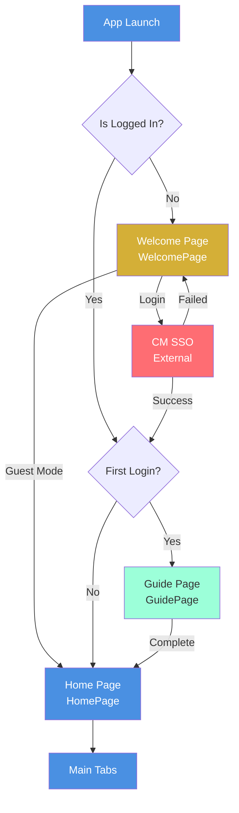
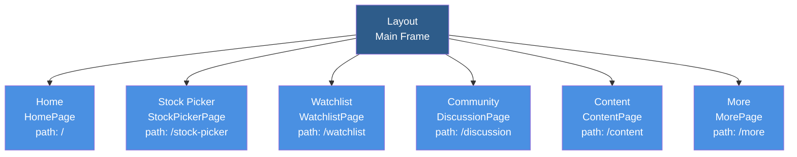
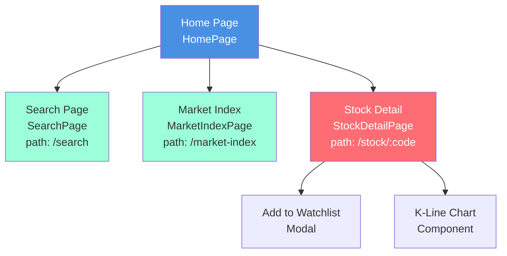
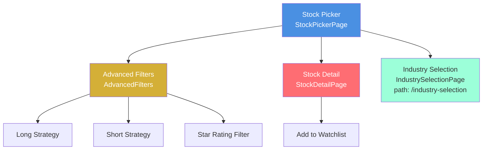
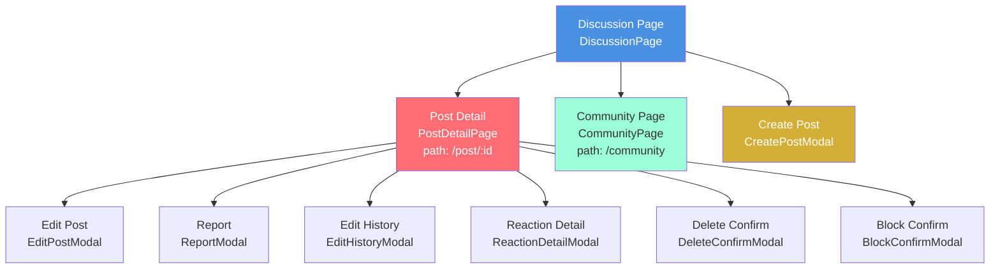
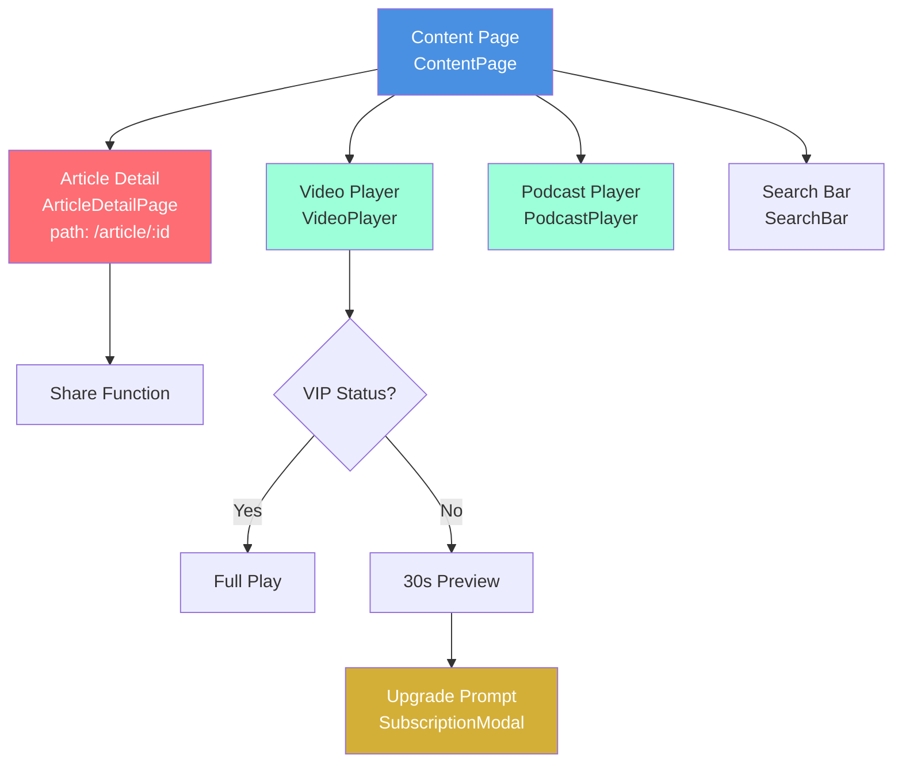
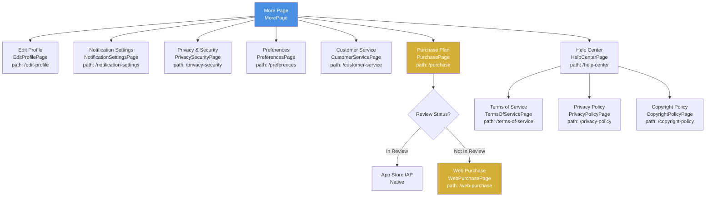
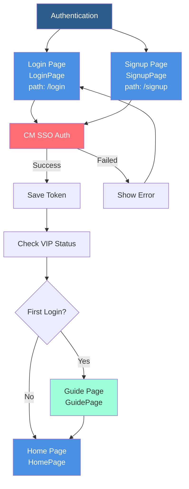

# Application Navigation Flow

## Updated Date
March 3, 2026

## Overview
This document describes the complete page navigation structure of the Ruju Stock App, including routing configuration and page transition logic. This navigation architecture is applicable to React, Swift (SwiftUI), and Kotlin (Jetpack Compose) implementations.

---

## I. Complete Navigation Architecture

### 1.1 Main Navigation Flow



### 1.2 Main Tab Structure (With Layout Navigation)



### 1.3 Home Page Sub-Navigation



### 1.4 Stock Picker Sub-Navigation



### 1.5 Community Discussion Sub-Navigation



### 1.6 Content Area Sub-Navigation



### 1.7 More Page Sub-Navigation



### 1.8 Authentication Flow



---

## II. Route Configuration Table

### 2.1 Standalone Pages (Without Layout)

| Path | Component | Description | Auth Required |
|------|-----------|-------------|---------------|
| `/login` | LoginPage | Login page | ✗ |
| `/signup` | SignupPage | Signup page | ✗ |
| `/guide` | GuidePage | Onboarding guide | ✓ |
| `/edit-profile` | EditProfilePage | Edit user profile | ✓ |
| `/notification-settings` | NotificationSettingsPage | Notification settings | ✓ |
| `/privacy-security` | PrivacySecurityPage | Privacy & security | ✓ |
| `/preferences` | PreferencesPage | User preferences | ✓ |
| `/customer-service` | CustomerServicePage | Customer service | ✓ |
| `/help-center` | HelpCenterPage | Help center | ✗ |
| `/purchase` | PurchasePage | Purchase plans | ✓ |
| `/web-purchase` | WebPurchasePage | Web purchase | ✓ |
| `/terms-of-service` | TermsOfServicePage | Terms of service | ✗ |
| `/privacy-policy` | PrivacyPolicyPage | Privacy policy | ✗ |
| `/copyright-policy` | CopyrightPolicyPage | Copyright policy | ✗ |

### 2.2 Main Frame Pages (With Layout)

| Path | Component | Description | Bottom Tab |
|------|-----------|-------------|------------|
| `/` | HomePage | Home page | ✓ |
| `/stock-picker` | StockPickerPage | Stock picker | ✓ |
| `/watchlist` | WatchlistPage | Watchlist | ✓ |
| `/discussion` | DiscussionPage | Community discussion | ✓ |
| `/content` | ContentPage | Content area | ✓ |
| `/more` | MorePage | More options | ✓ |

### 2.3 Detail Pages (Without Layout)

| Path | Component | Description | Parameters |
|------|-----------|-------------|------------|
| `/stock/:code` | StockDetailPage | Stock detail | code: Stock code |
| `/article/:id` | ArticleDetailPage | Article detail | id: Article ID |
| `/post/:id` | PostDetailPage | Post detail | id: Post ID |
| `/search` | SearchPage | Search page | - |
| `/market-index` | MarketIndexPage | Market index | - |
| `/industry-selection` | IndustrySelectionPage | Industry selection | - |
| `/community` | CommunityPage | Community page | - |

---

## III. SwiftUI Implementation Guide

### 3.1 Basic Route Structure

```swift
// AppRouter.swift
import SwiftUI

enum AppRoute: Hashable {
    case welcome
    case login
    case signup
    case guide
    case home
    case stockPicker
    case watchlist
    case discussion
    case content
    case more
    case stockDetail(code: String)
    case articleDetail(id: String)
    case postDetail(id: String)
    case search
    case marketIndex
    case industrySelection
    case community
    case editProfile
    case notificationSettings
    case privacySecurity
    case preferences
    case customerService
    case helpCenter
    case purchase
    case webPurchase
    case termsOfService
    case privacyPolicy
    case copyrightPolicy
}

// Main Navigation Structure
struct AppNavigationView: View {
    @StateObject private var authManager = AuthManager()
    @State private var navigationPath = NavigationPath()
    
    var body: some View {
        NavigationStack(path: $navigationPath) {
            Group {
                if !authManager.isLoggedIn {
                    WelcomeView()
                } else if authManager.isFirstLogin {
                    GuideView()
                } else {
                    MainTabView()
                }
            }
            .navigationDestination(for: AppRoute.self) { route in
                routeView(for: route)
            }
        }
        .environmentObject(authManager)
    }
    
    @ViewBuilder
    private func routeView(for route: AppRoute) -> some View {
        switch route {
        case .login:
            LoginView()
        case .signup:
            SignupView()
        case .guide:
            GuideView()
        case .home:
            HomeView()
        case .stockPicker:
            StockPickerView()
        case .watchlist:
            WatchlistView()
        case .discussion:
            DiscussionView()
        case .content:
            ContentView()
        case .more:
            MoreView()
        case .stockDetail(let code):
            StockDetailView(stockCode: code)
        case .articleDetail(let id):
            ArticleDetailView(articleId: id)
        case .postDetail(let id):
            PostDetailView(postId: id)
        case .search:
            SearchView()
        case .marketIndex:
            MarketIndexView()
        case .industrySelection:
            IndustrySelectionView()
        case .community:
            CommunityView()
        case .editProfile:
            EditProfileView()
        case .notificationSettings:
            NotificationSettingsView()
        case .privacySecurity:
            PrivacySecurityView()
        case .preferences:
            PreferencesView()
        case .customerService:
            CustomerServiceView()
        case .helpCenter:
            HelpCenterView()
        case .purchase:
            PurchaseView()
        case .webPurchase:
            WebPurchaseView()
        case .termsOfService:
            TermsOfServiceView()
        case .privacyPolicy:
            PrivacyPolicyView()
        case .copyrightPolicy:
            CopyrightPolicyView()
        default:
            EmptyView()
        }
    }
}
```

### 3.2 Main Tab Structure

```swift
// MainTabView.swift
struct MainTabView: View {
    @State private var selectedTab = 0
    
    var body: some View {
        TabView(selection: $selectedTab) {
            HomeView()
                .tabItem {
                    Image(systemName: "house.fill")
                    Text("Home")
                }
                .tag(0)
            
            StockPickerView()
                .tabItem {
                    Image(systemName: "chart.line.uptrend.xyaxis")
                    Text("Picker")
                }
                .tag(1)
            
            WatchlistView()
                .tabItem {
                    Image(systemName: "star.fill")
                    Text("Watchlist")
                }
                .tag(2)
            
            DiscussionView()
                .tabItem {
                    Image(systemName: "bubble.left.and.bubble.right.fill")
                    Text("Community")
                }
                .tag(3)
            
            ContentView()
                .tabItem {
                    Image(systemName: "play.rectangle.fill")
                    Text("Content")
                }
                .tag(4)
            
            MoreView()
                .tabItem {
                    Image(systemName: "ellipsis")
                    Text("More")
                }
                .tag(5)
        }
        .accentColor(Color(hex: "#4A90E2"))
    }
}
```

### 3.3 Navigation Helper Functions

```swift
// NavigationHelper.swift
extension View {
    func navigate(to route: AppRoute) {
        // Use NavigationPath for navigation
        NotificationCenter.default.post(
            name: .navigateToRoute,
            object: route
        )
    }
    
    func popToRoot() {
        NotificationCenter.default.post(
            name: .popToRoot,
            object: nil
        )
    }
}

// Login Flow Navigation Manager
class AuthNavigationManager: ObservableObject {
    @Published var shouldShowGuide = false
    @Published var shouldShowHome = false
    
    func handleLoginSuccess(user: User) {
        // Save user info
        UserDefaults.standard.set(user.token, forKey: "authToken")
        
        // Check VIP status
        checkVIPStatus(user: user)
        
        // Determine navigation
        if user.isFirstLogin {
            shouldShowGuide = true
        } else {
            shouldShowHome = true
        }
    }
    
    private func checkVIPStatus(user: User) {
        // Save VIP status
        UserDefaults.standard.set(user.vipStatus.hasPremium, forKey: "hasPremium")
        UserDefaults.standard.set(user.vipStatus.expiryDate, forKey: "vipExpiryDate")
    }
}
```

---

## IV. Kotlin (Jetpack Compose) Implementation Guide

### 4.1 Basic Route Structure

```kotlin
// AppNavigation.kt
import androidx.compose.runtime.*
import androidx.navigation.NavHostController
import androidx.navigation.compose.NavHost
import androidx.navigation.compose.composable
import androidx.navigation.compose.rememberNavController
import androidx.navigation.navArgument
import androidx.navigation.NavType

// Route Definitions
sealed class AppRoute(val route: String) {
    object Welcome : AppRoute("welcome")
    object Login : AppRoute("login")
    object Signup : AppRoute("signup")
    object Guide : AppRoute("guide")
    object Home : AppRoute("home")
    object StockPicker : AppRoute("stock-picker")
    object Watchlist : AppRoute("watchlist")
    object Discussion : AppRoute("discussion")
    object Content : AppRoute("content")
    object More : AppRoute("more")
    object StockDetail : AppRoute("stock/{code}") {
        fun createRoute(code: String) = "stock/$code"
    }
    object ArticleDetail : AppRoute("article/{id}") {
        fun createRoute(id: String) = "article/$id"
    }
    object PostDetail : AppRoute("post/{id}") {
        fun createRoute(id: String) = "post/$id"
    }
    object Search : AppRoute("search")
    object MarketIndex : AppRoute("market-index")
    object IndustrySelection : AppRoute("industry-selection")
    object Community : AppRoute("community")
    object EditProfile : AppRoute("edit-profile")
    object NotificationSettings : AppRoute("notification-settings")
    object PrivacySecurity : AppRoute("privacy-security")
    object Preferences : AppRoute("preferences")
    object CustomerService : AppRoute("customer-service")
    object HelpCenter : AppRoute("help-center")
    object Purchase : AppRoute("purchase")
    object WebPurchase : AppRoute("web-purchase")
    object TermsOfService : AppRoute("terms-of-service")
    object PrivacyPolicy : AppRoute("privacy-policy")
    object CopyrightPolicy : AppRoute("copyright-policy")
}

@Composable
fun AppNavigation(
    authManager: AuthManager = remember { AuthManager() }
) {
    val navController = rememberNavController()
    val startDestination = when {
        !authManager.isLoggedIn -> AppRoute.Welcome.route
        authManager.isFirstLogin -> AppRoute.Guide.route
        else -> AppRoute.Home.route
    }
    
    NavHost(
        navController = navController,
        startDestination = startDestination
    ) {
        // Authentication pages
        composable(AppRoute.Welcome.route) {
            WelcomeScreen(navController)
        }
        composable(AppRoute.Login.route) {
            LoginScreen(navController, authManager)
        }
        composable(AppRoute.Signup.route) {
            SignupScreen(navController, authManager)
        }
        composable(AppRoute.Guide.route) {
            GuideScreen(navController)
        }
        
        // Main pages (with bottom navigation)
        composable(AppRoute.Home.route) {
            MainScreen(navController)
        }
        
        // Detail pages
        composable(
            route = AppRoute.StockDetail.route,
            arguments = listOf(navArgument("code") { type = NavType.StringType })
        ) { backStackEntry ->
            val code = backStackEntry.arguments?.getString("code") ?: ""
            StockDetailScreen(navController, code)
        }
        
        composable(
            route = AppRoute.ArticleDetail.route,
            arguments = listOf(navArgument("id") { type = NavType.StringType })
        ) { backStackEntry ->
            val id = backStackEntry.arguments?.getString("id") ?: ""
            ArticleDetailScreen(navController, id)
        }
        
        composable(
            route = AppRoute.PostDetail.route,
            arguments = listOf(navArgument("id") { type = NavType.StringType })
        ) { backStackEntry ->
            val id = backStackEntry.arguments?.getString("id") ?: ""
            PostDetailScreen(navController, id)
        }
        
        // Other pages
        composable(AppRoute.Search.route) {
            SearchScreen(navController)
        }
        composable(AppRoute.MarketIndex.route) {
            MarketIndexScreen(navController)
        }
        composable(AppRoute.IndustrySelection.route) {
            IndustrySelectionScreen(navController)
        }
        composable(AppRoute.Community.route) {
            CommunityScreen(navController)
        }
        composable(AppRoute.EditProfile.route) {
            EditProfileScreen(navController)
        }
        composable(AppRoute.NotificationSettings.route) {
            NotificationSettingsScreen(navController)
        }
        composable(AppRoute.PrivacySecurity.route) {
            PrivacySecurityScreen(navController)
        }
        composable(AppRoute.Preferences.route) {
            PreferencesScreen(navController)
        }
        composable(AppRoute.CustomerService.route) {
            CustomerServiceScreen(navController)
        }
        composable(AppRoute.HelpCenter.route) {
            HelpCenterScreen(navController)
        }
        composable(AppRoute.Purchase.route) {
            PurchaseScreen(navController)
        }
        composable(AppRoute.WebPurchase.route) {
            WebPurchaseScreen(navController)
        }
        composable(AppRoute.TermsOfService.route) {
            TermsOfServiceScreen(navController)
        }
        composable(AppRoute.PrivacyPolicy.route) {
            PrivacyPolicyScreen(navController)
        }
        composable(AppRoute.CopyrightPolicy.route) {
            CopyrightPolicyScreen(navController)
        }
    }
}
```

### 4.2 Main Tab Structure

```kotlin
// MainScreen.kt
@Composable
fun MainScreen(navController: NavHostController) {
    var selectedTab by remember { mutableStateOf(0) }
    
    Scaffold(
        bottomBar = {
            NavigationBar(
                containerColor = Color.White,
                contentColor = Color(0xFF4A90E2)
            ) {
                NavigationBarItem(
                    icon = { Icon(Icons.Filled.Home, "Home") },
                    label = { Text("Home") },
                    selected = selectedTab == 0,
                    onClick = { selectedTab = 0 }
                )
                NavigationBarItem(
                    icon = { Icon(Icons.Filled.TrendingUp, "Picker") },
                    label = { Text("Picker") },
                    selected = selectedTab == 1,
                    onClick = { selectedTab = 1 }
                )
                NavigationBarItem(
                    icon = { Icon(Icons.Filled.Star, "Watchlist") },
                    label = { Text("Watchlist") },
                    selected = selectedTab == 2,
                    onClick = { selectedTab = 2 }
                )
                NavigationBarItem(
                    icon = { Icon(Icons.Filled.Chat, "Community") },
                    label = { Text("Community") },
                    selected = selectedTab == 3,
                    onClick = { selectedTab = 3 }
                )
                NavigationBarItem(
                    icon = { Icon(Icons.Filled.PlayCircle, "Content") },
                    label = { Text("Content") },
                    selected = selectedTab == 4,
                    onClick = { selectedTab = 4 }
                )
                NavigationBarItem(
                    icon = { Icon(Icons.Filled.MoreHoriz, "More") },
                    label = { Text("More") },
                    selected = selectedTab == 5,
                    onClick = { selectedTab = 5 }
                )
            }
        }
    ) { paddingValues ->
        Box(modifier = Modifier.padding(paddingValues)) {
            when (selectedTab) {
                0 -> HomeScreen(navController)
                1 -> StockPickerScreen(navController)
                2 -> WatchlistScreen(navController)
                3 -> DiscussionScreen(navController)
                4 -> ContentScreen(navController)
                5 -> MoreScreen(navController)
            }
        }
    }
}
```

### 4.3 Navigation Helper Functions

```kotlin
// NavigationHelper.kt
class NavigationHelper(private val navController: NavHostController) {
    
    fun navigateToStockDetail(code: String) {
        navController.navigate(AppRoute.StockDetail.createRoute(code))
    }
    
    fun navigateToArticleDetail(id: String) {
        navController.navigate(AppRoute.ArticleDetail.createRoute(id))
    }
    
    fun navigateToPostDetail(id: String) {
        navController.navigate(AppRoute.PostDetail.createRoute(id))
    }
    
    fun navigateToLogin() {
        navController.navigate(AppRoute.Login.route) {
            popUpTo(navController.graph.startDestinationId) {
                inclusive = true
            }
        }
    }
    
    fun navigateToHome() {
        navController.navigate(AppRoute.Home.route) {
            popUpTo(navController.graph.startDestinationId) {
                inclusive = true
            }
        }
    }
    
    fun popBackStack() {
        navController.popBackStack()
    }
    
    fun popToRoot() {
        navController.popBackStack(
            navController.graph.startDestinationId,
            inclusive = false
        )
    }
}

// Login Flow Manager
class AuthNavigationManager(
    private val navController: NavHostController,
    private val context: Context
) {
    private val sharedPrefs = context.getSharedPreferences("auth", Context.MODE_PRIVATE)
    
    fun handleLoginSuccess(user: User) {
        // Save user info
        sharedPrefs.edit().apply {
            putString("authToken", user.token)
            putBoolean("hasPremium", user.vipStatus.hasPremium)
            putString("vipExpiryDate", user.vipStatus.expiryDate)
            apply()
        }
        
        // Determine navigation
        if (user.isFirstLogin) {
            navController.navigate(AppRoute.Guide.route) {
                popUpTo(AppRoute.Login.route) { inclusive = true }
            }
        } else {
            navController.navigate(AppRoute.Home.route) {
                popUpTo(AppRoute.Login.route) { inclusive = true }
            }
        }
    }
    
    fun checkVIPStatus(): Boolean {
        val hasPremium = sharedPrefs.getBoolean("hasPremium", false)
        val expiryDate = sharedPrefs.getString("vipExpiryDate", null)
        
        if (hasPremium && expiryDate != null) {
            val expiry = SimpleDateFormat("yyyy-MM-dd", Locale.getDefault())
                .parse(expiryDate)
            val now = Date()
            
            if (expiry != null && expiry.before(now)) {
                // VIP expired
                sharedPrefs.edit().putBoolean("hasPremium", false).apply()
                return false
            }
        }
        
        return hasPremium
    }
}
```

---

## V. Permission Control Route Guard

### 5.1 Swift Implementation

```swift
// RouteGuard.swift
class RouteGuard: ObservableObject {
    @Published var isAuthenticated = false
    @Published var hasPremium = false
    
    func canAccess(route: AppRoute) -> (canAccess: Bool, reason: String?) {
        switch route {
        // Routes requiring login
        case .guide, .editProfile, .notificationSettings,
             .privacySecurity, .preferences, .customerService,
             .purchase, .webPurchase:
            if !isAuthenticated {
                return (false, "Please login first")
            }
            
        // Routes requiring VIP
        case .stockPicker:
            if !isAuthenticated {
                return (false, "Please login first")
            }
            if !hasPremium {
                return (false, "This feature requires Premium membership")
            }
            
        default:
            break
        }
        
        return (true, nil)
    }
    
    func checkAndNavigate(to route: AppRoute) -> Bool {
        let (canAccess, reason) = canAccess(route: route)
        
        if !canAccess {
            // Show alert message
            if let reason = reason {
                showAlert(message: reason)
            }
            return false
        }
        
        return true
    }
    
    private func showAlert(message: String) {
        // Show alert
    }
}
```

### 5.2 Kotlin Implementation

```kotlin
// RouteGuard.kt
class RouteGuard(private val context: Context) {
    private val sharedPrefs = context.getSharedPreferences("auth", Context.MODE_PRIVATE)
    
    fun canAccess(route: AppRoute): Pair<Boolean, String?> {
        val isAuthenticated = sharedPrefs.getString("authToken", null) != null
        val hasPremium = sharedPrefs.getBoolean("hasPremium", false)
        
        return when (route) {
            // Routes requiring login
            is AppRoute.Guide, is AppRoute.EditProfile,
            is AppRoute.NotificationSettings, is AppRoute.PrivacySecurity,
            is AppRoute.Preferences, is AppRoute.CustomerService,
            is AppRoute.Purchase, is AppRoute.WebPurchase -> {
                if (!isAuthenticated) {
                    Pair(false, "Please login first")
                } else {
                    Pair(true, null)
                }
            }
            
            // Routes requiring VIP
            is AppRoute.StockPicker -> {
                when {
                    !isAuthenticated -> Pair(false, "Please login first")
                    !hasPremium -> Pair(false, "This feature requires Premium membership")
                    else -> Pair(true, null)
                }
            }
            
            else -> Pair(true, null)
        }
    }
    
    fun checkAndNavigate(
        navController: NavHostController,
        route: AppRoute,
        onDenied: (String) -> Unit = {}
    ): Boolean {
        val (canAccess, reason) = canAccess(route)
        
        if (!canAccess && reason != null) {
            onDenied(reason)
            return false
        }
        
        return true
    }
}
```

---

## VI. Deep Link Configuration

### 6.1 URL Scheme Definitions

| Feature | Deep Link | Description |
|---------|-----------|-------------|
| Stock Detail | `ruju://stock/:code` | Open specific stock detail |
| Article Detail | `ruju://article/:id` | Open specific article |
| Post Detail | `ruju://post/:id` | Open specific post |
| Purchase Page | `ruju://purchase` | Open purchase plans |
| Guide Page | `ruju://guide` | Open onboarding guide |

### 6.2 Swift Deep Link Handler

```swift
// DeepLinkHandler.swift
class DeepLinkHandler: ObservableObject {
    @Published var activeRoute: AppRoute?
    
    func handle(url: URL) {
        guard url.scheme == "ruju" else { return }
        
        let path = url.host ?? ""
        let components = url.pathComponents.filter { $0 != "/" }
        
        switch path {
        case "stock":
            if let code = components.first {
                activeRoute = .stockDetail(code: code)
            }
        case "article":
            if let id = components.first {
                activeRoute = .articleDetail(id: id)
            }
        case "post":
            if let id = components.first {
                activeRoute = .postDetail(id: id)
            }
        case "purchase":
            activeRoute = .purchase
        case "guide":
            activeRoute = .guide
        default:
            break
        }
    }
}
```

### 6.3 Kotlin Deep Link Handler

```kotlin
// DeepLinkHandler.kt
class DeepLinkHandler(private val navController: NavHostController) {
    
    fun handle(uri: Uri) {
        if (uri.scheme != "ruju") return
        
        when (uri.host) {
            "stock" -> {
                val code = uri.pathSegments.firstOrNull()
                if (code != null) {
                    navController.navigate(AppRoute.StockDetail.createRoute(code))
                }
            }
            "article" -> {
                val id = uri.pathSegments.firstOrNull()
                if (id != null) {
                    navController.navigate(AppRoute.ArticleDetail.createRoute(id))
                }
            }
            "post" -> {
                val id = uri.pathSegments.firstOrNull()
                if (id != null) {
                    navController.navigate(AppRoute.PostDetail.createRoute(id))
                }
            }
            "purchase" -> {
                navController.navigate(AppRoute.Purchase.route)
            }
            "guide" -> {
                navController.navigate(AppRoute.Guide.route)
            }
        }
    }
}
```

---

## VII. Page Transition Animations

### 7.1 Swift Transition Animations

```swift
// TransitionAnimations.swift
extension AnyTransition {
    static var slideFromRight: AnyTransition {
        .asymmetric(
            insertion: .move(edge: .trailing),
            removal: .move(edge: .leading)
        )
    }
    
    static var slideFromBottom: AnyTransition {
        .asymmetric(
            insertion: .move(edge: .bottom),
            removal: .move(edge: .bottom)
        )
    }
    
    static var fadeScale: AnyTransition {
        .scale.combined(with: .opacity)
    }
}
```

### 7.2 Kotlin Transition Animations

```kotlin
// TransitionAnimations.kt
import androidx.compose.animation.*
import androidx.compose.animation.core.*

object NavigationTransitions {
    fun slideInFromRight() = slideInHorizontally(
        initialOffsetX = { it },
        animationSpec = tween(300, easing = FastOutSlowInEasing)
    )
    
    fun slideOutToLeft() = slideOutHorizontally(
        targetOffsetX = { -it },
        animationSpec = tween(300, easing = FastOutSlowInEasing)
    )
    
    fun slideInFromBottom() = slideInVertically(
        initialOffsetY = { it },
        animationSpec = tween(300, easing = FastOutSlowInEasing)
    )
    
    fun fadeIn() = fadeIn(
        animationSpec = tween(300)
    )
    
    fun fadeOut() = fadeOut(
        animationSpec = tween(300)
    )
}
```

---

## VIII. Testing Checklist

### Navigation Testing Items

- [ ] Welcome page → Login flow
- [ ] Welcome page → Guest mode
- [ ] Login success → First time → Guide → Home
- [ ] Login success → Not first time → Home
- [ ] Home → Tab switching
- [ ] Home → Stock detail → Back
- [ ] Stock picker → Filter → Stock detail
- [ ] Community → Post detail → Edit/Delete
- [ ] Content → Article detail → Share
- [ ] More → Purchase → Review status check
- [ ] Deep link paths testing
- [ ] Permission control testing (Login/VIP)
- [ ] Back button/gesture testing
- [ ] Navigation state persistence testing
- [ ] Multiple rapid tap debounce testing

---

## IX. Best Practices

### Navigation Best Practices

1. **State Management**
   - Use global state managers (SwiftUI: @EnvironmentObject, Compose: remember/ViewModel)
   - Avoid losing state during navigation

2. **Memory Management**
   - Clean up unnecessary navigation stacks promptly
   - Avoid memory leaks from circular references

3. **User Experience**
   - Provide clear back paths
   - Show confirmation dialogs before important actions
   - Display loading states appropriately

4. **Error Handling**
   - Show 404 page for invalid routes
   - Provide retry options for network errors
   - Show upgrade prompts for insufficient permissions

---

## X. Related Documents

- **Complete PRD:** `/docs/PRD.md`
- **Login Flow Documentation:** `/docs/WELCOME_LOGIN_FLOW.md`
- **Purchase Configuration:** `/docs/PURCHASE_CONFIG.md`
- **Native Features:** `/docs/NATIVE_FEATURES.md`

---

**Document Version:** 1.0  
**Last Updated:** March 3, 2026
